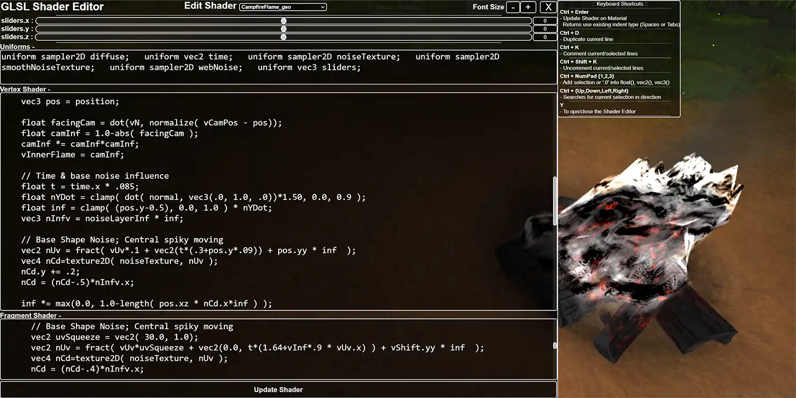

# pxlNav v1.0.0
Javascript Player Controller & Environment Manager for Three.js

#### Visit the [pxlNav Documentation](https://procstack.github.io/pxlNav-docs/)

**Since the docs are still being written,**
** &nbsp;&nbsp; If you have any questions / feedback, feel free to join the [pxlNav Support](https://discord.gg/UqEY9mpZ9x) discord group.**

**Visit [procstack.github.io site](https://procstack.github.io/) to see camera location switching action.**

**Now with React & NextJS support, see `./src/next-react-dev` for project examples**

 <b>If you'd like to roam around a coastal environment,</b>
  vvv&nbsp;&nbsp; <b>visit <a href="https://procstack.github.io/Outlet.htm" alt="pxlNav Example The Outlet">procstack.github.io/Outlet.htm</a></b>&nbsp;&nbsp; vvv
 <h5></h5>

##  **Index**
* [Install Files](#install-files)
* [Quick Links](#the-good-bits)
* [Intention For pxlNav](#intention)
* [In-Browser / Javascript Features](#in-browser--javascript-features)
* [3d Scene File Features](#features-added-through-your-cgi-program-of-choice)
* [Shader Editor Keyboard Shortcuts](#shader-editor-keyboard-shortcuts)
* [In-Progress Features](#work-in-progress-features)
 

--------------------------------------------------------------------------------------------

## Install Files
 - `./dist/pxlNav.esm.js` - JS Module file
 - `./dist/pxlNavStyle.min.css` - CSS Style for things like Loading bar, Shader Editor, and more
 - `./dist/pxlNavLoader_basic.js` - Basic implementation of pxlNav; import, set options, and build.
 - `./examples/pxlNavLoader_switchSpace.js` - Basic implementation of a external trigger to swap room environments
 - `./dist/libs/three/...` - Some changes needed to be made to the FBXLoader.js file, please include the `libs` folder along side `pxlNav.esm.js` to run pxlNav

&nbsp;&nbsp; **CJS & UMD versions needs testing, see `./builds` for these versions.**
 &nbsp;&nbsp; **Please bare with me while I work out any NPM packaging issues.**

##### 
[^ Top](#index)

--------------------------------------------------------------------------------------------

## The Good Bits
**Wanna see example rooms using 3d fbx files?**
 &nbsp;&nbsp;&nbsp; [procstack.github.io Rooms](https://github.com/ProcStack/pxlNav/tree/main/examples/js/pxlRooms)

 &nbsp;&nbsp;**For `pxlNav` Documentation -**
 &nbsp;&nbsp;&nbsp;&nbsp;[pxlNav Documentation](https://github.com/ProcStack/pxlNav/tree/main/docs)

 &nbsp;&nbsp;**For `pxlNav` changes between versions -**
 &nbsp;&nbsp;&nbsp;&nbsp;[pxlNav Change Log](https://github.com/ProcStack/pxlNav/blob/main/ChangeLog.md)

 &nbsp;&nbsp;`pxlNav` dev entry point is -
 &nbsp;&nbsp;&nbsp;&nbsp;`./src/pxlNav.js`

##### 
[^ Top](#index)

--------------------------------------------------------------------------------------------

## Intention
`pxlNav` is an interactive layer built on top of Three.js' render engine.
 Creating a framework which understands FBX files created with object tags set in Maya or Blender or *[Name your CGI program here]*.
 Turning your 3d modeling software into a level editor for Three.js
 
 It's basically a game engine for Three.js

##### 
[^ Top](#index)

--------------------------------------------------------------------------------------------

## In-Browser / Javascript Features
&nbsp; _ **FPV Camera Control** on PC & Mobile
 &nbsp; _ **Navigation using W,A,S,D or Arrow Keys**
 &nbsp; _ Easily load any **FBX file** for a pxlRoom (Scene / Level) or Objects
 &nbsp;&nbsp;&nbsp; \*FBXs are 3d scene files you can make in most CGI programs; like Maya or Blender 

 &nbsp; _ **Animation Rig & Clip Files** are easily managed
 &nbsp; _ A simple **Animation State Machine** to set the next **Clip**
 &nbsp;&nbsp;&nbsp; \*Once the current animation clip finishes, set what the animating Rig/Object does next.
 &nbsp;&nbsp;&nbsp;&nbsp; Loop the clip infinitely, play a specific clip after, or pick a random clip from an array you set in javascript.

 &nbsp; _ Pre-made **Particle Effects** or customize the particle system through Shaders
 &nbsp;&nbsp;&nbsp; \*Pre-made particle effects - Billowing smoke, fire embers, floating environment dust, & snow with floor collider
 &nbsp; _ **Motion Blur**, **Chromatic Aberrations**, multiple **Anti-Aliasing** options, & more premade **Post-Processes**
 &nbsp;&nbsp;&nbsp;&nbsp; *( Off by default, available through `this.pxlEnv` )*
 &nbsp; _ **OpenGL ES Shader Editor**
 &nbsp;&nbsp;&nbsp; \*Hit `Y` in browser to open the Shader Editor with regex enabled [Keyboard Shortcuts](#shader-editor-keyboard-shortcuts) for easier editing

 &nbsp; _ Subscribe to **Callback** events & run **Triggers** to listen or control pxlNav from outside of pxlNav.
 &nbsp;&nbsp;&nbsp; \*You can subscribe & trigger your own custom events & code for your pxlRoom as well
 &nbsp; _ Easily assign custom materials (like OpenGL ES Shaders) to objects in your FBX when the file loads.
 &nbsp;&nbsp;&nbsp; \*Your object will be listed under the Shader Editor's `Edit Shader` pulldown.
* &nbsp;&nbsp;&nbsp;&nbsp;&nbsp;-- `this` refers to your pxlRoom's Javascript object in code*
 

##### 
[^ Top](#index)

--------------------------------------------------------------------------------------------

## Features added through your CGI program of choice
 &nbsp; _ **Camera Position & Aim** initial locations and named locations you can warp to.
 &nbsp; _ **Auto Camera Rails** 
 &nbsp;&nbsp;&nbsp; \*Animated Camera Paths for Position, Look At, & Up for animation sequencing
 &nbsp;&nbsp;&nbsp; *(Open Geometry or Nurb Curve)*

&nbsp; _ **Instanced geometry**
 &nbsp;&nbsp;&nbsp; \*Instance individually to Locator/Null Objects; or in mass to every Vertex in an object
 &nbsp; _ **Glowing Objects**
 &nbsp; _ **Item Pickups**
 &nbsp; _ **Jump Pads**

 &nbsp; _ **Point-to-Point Warp Pads** *( Teleporters / Portals )*
 &nbsp;&nbsp;&nbsp; \*Link a Collision Surface to a target Transform to move the user to once they step on the surface.
 &nbsp; _ **Point-to-Room Warp Pads**
 &nbsp;&nbsp;&nbsp; \*Move between other pxlRooms like changing game levels ( separate FBX files & javascript )

 &nbsp; _ **Ground Collider Objects**
 &nbsp;&nbsp;&nbsp; \*Floor terrain, things to jump on top of, floors of a building, and Walls to limit user movement.
 &nbsp;&nbsp;&nbsp; 'Walls' being lack of a collider object under the player, preventing the users from walking off the ground.
 &nbsp;&nbsp;&nbsp;&nbsp;&nbsp; This gives an easy way to lock the user's camera due to environmental design,
 &nbsp;&nbsp;&nbsp;&nbsp;&nbsp;&nbsp;&nbsp; Like, if there was no collider under a named Camera Position, then warp to that location for a still camera shot.

 &nbsp; _ **Clickable Objects to run javascript functions**
 &nbsp; _ **Scriptable Objects**
 &nbsp;&nbsp;&nbsp; \*Access these objects by their name in your pxlRoom's javascript code; `this.geoList[*Your_Object_Name*]`
* &nbsp;&nbsp;&nbsp;&nbsp;&nbsp;-- `this` refers to your pxlRoom's Javascript object in code*
 

##### 
[^ Top](#index)

--------------------------------------------------------------------------------------------

## Shader Editor Keyboard Shortcuts

&nbsp; _ Browser default Copy, Cut, Paste, Undo, Redo, etc.
 &nbsp; _ **`Enter`** - New lines use the existing indent type (Spaces or Tabs)
 &nbsp; _ **`Ctrl + Enter`** - Update Shader on Material
 &nbsp; _ **`Ctrl + D`** -  Duplicate current line
 &nbsp; _ **`Ctrl + K`** - Comment current/selected lines
 &nbsp; _ **`Ctrl + Shift + K`** - Uncomment current/selected lines
 &nbsp; _ **`Ctrl + NumPad {1,2,3}`** - Add selection or '.0' into float(), vec2(), vec3()
 &nbsp;&nbsp;&nbsp;&nbsp;&nbsp;  Select `myVar` & Ctrl+3 -> `vec3(myVar)`
 &nbsp;&nbsp;&nbsp;&nbsp;&nbsp;  No Selection & Ctrl+2 -> `vec2(.0, .0)`
 &nbsp; _ **`Ctrl + {Up,Down,Left,Right}`** - Quick search
 &nbsp;&nbsp;&nbsp;&nbsp;&nbsp; Searches for your current selection in that direction
 &nbsp; _ Click off the editor -or- hit **`Y`** - To Open / Close the Shader Editor

##### 
[^ Top](#index)

--------------------------------------------------------------------------------------------

## Work-in-Progress Features
&nbsp; _ **Third person control** is not easily available, access it through `this.pxlCamera`
 &nbsp; _ No movement controls on **Mobile** yet
 &nbsp;&nbsp;&nbsp; \*Mobile will use your Camera Position & Aim locators in your FBX file
 &nbsp;&nbsp;&nbsp; \*If you add an Auto Camera Rail, it'll use that by default and loop the camera on the found Curve object

 &nbsp; _ **Networking** as mostly been removed for safety concerns -
 &nbsp;&nbsp;&nbsp; Avatars, WebCam Video Streaming, & Mic Audio, but it can be implemented through pxlNav `Extensions`
 &nbsp;&nbsp;&nbsp; \*Enable specific extensions with `pxlNav.initExtension("Networking", *Your_Extension_Loaded_Callback*)`
 &nbsp;&nbsp;&nbsp; \*The default socket messages for `Stream Elements` is currently set up in `./src/pxlNav/extensions/Networking.js`

 &nbsp; _ **Music** & **Video** streams have no Callbacks & Triggers yet.
 &nbsp;&nbsp;&nbsp; They can be enabled from your pxlRoom, but they will be converted into 'Extensions' soon, `this.pxlEnv.pxlAudio` &  `this.pxlEnv.pxlVideo`
 &nbsp;&nbsp;&nbsp; \*Music can be streamed in through a .m3u link online
 &nbsp;&nbsp;&nbsp; \*Video can be streamed most video bridge relays with accessable URLs, like Amazon Web Services' IVS generated stream URLs.
 &nbsp;&nbsp;&nbsp;&nbsp;&nbsp; The video feed can be assigned to a material/shader like any other texture map in Three.js
 &nbsp;&nbsp;&nbsp; \*Music & Video streams will attempt to reconnect automatically if a feed drops.
 &nbsp;&nbsp;&nbsp;&nbsp;&nbsp; Prioritizing any Audio found in Video Streams as the primary Audio Source to play in pxlNav.
 &nbsp;&nbsp;&nbsp;&nbsp;&nbsp; This means you can have a constant Music stream playing over the internet,
 &nbsp;&nbsp;&nbsp;&nbsp;&nbsp;&nbsp;&nbsp; Then interupt that Music feed by starting a Video Stream to your target video streaming service.
* &nbsp;&nbsp;&nbsp;&nbsp;&nbsp;-- `this` refers to your pxlRoom's Javascript object in code*
 

##### 
[^ Top](#index)

--------------------------------------------------------------------------------------------
