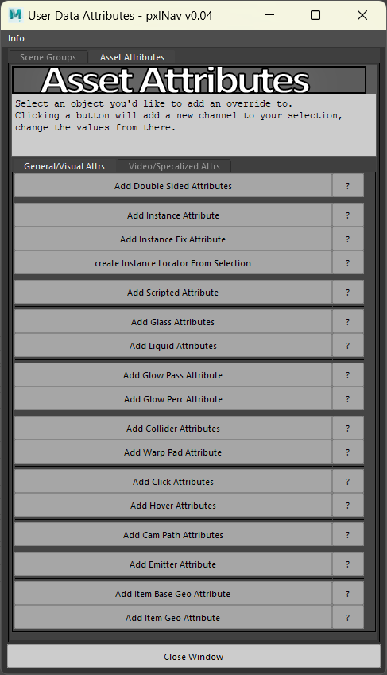

# User-Data Utility for Maya
### Written in Mel for wider usability in Maya
This is a break down of group structure and using the tools User-Detail buttons

## pxlRoom Group Heirarchy

Available Group types pxlNav understands.

Start with a top group --
+YourEnvironmentName_grp
   |-'Instances_grp'
   |-'Camera_grp'
   |-'[...]'
   |-'MainScene_grp'

Name your groups with the name of the group below somewhere in the name.  As long as 'Camera' is in your group name somewhere, it will load just fine.
  So your camera group can be 'Camera', 'Camera_grp', 'FunTimesCamera_grp', etc.
You're main geometry should be in your 'Scene' group.

Some Groups have 'Asset Attributes' you can use as well, leaving your object in your 'MainScene'

Required groups to use the associated feature -
 -Camera
 -AutoCamPaths
 -Sky
 -Colliders
 -Items ( For the Geo to use as the Item )
 -Instances ( For the Geo to instance, not locations )

Asset Attribute supported -
 -Glass
 -Clickable
 -Scripted

Lights will load from 'Lights_grp' or 'MainScene_grp'.

Cameras can either be -
+YourEnvironmentName_grp
   |-Cameras_grp
      |- Position_loc
      |- LookAt_loc
For Camera Positions, Group each locator-
+YourEnvironmentName_grp
   |- Cameras_grp
       |- CamLocationName_grp
           |- Position_loc
           |- LookAt_loc
       |- OtherLocationName_grp
           |- Position_loc
           |- LookAt_loc

## Object User-Detail Attributes

 While this readme is for the Maya Mel utility, these attributes can be added to objects in -
 Maya, Blender, Houdini, Cinema4d
 *(Other programs to be added to the list)*

 *Note* - `true/false` can be `0/1`

 Set object double sided; objects are set single sided by default
 &nbsp;&nbsp; `doubleSided` - bool; true,false

 Instancing Preparation -
 &nbsp;&nbsp; `Instance` - string; Name of 'Instances_grp' child object
 &nbsp;&nbsp; `fixInstMatrix` - bool; true,false
 &nbsp;&nbsp; `'Instance Locator From Selection'` - function; attach locator to your selection in Maya

 Make the object accessible through your pxlRoom JavaScript
 &nbsp;&nbsp; `Scripted` - bool; true,false

 Transparency with isolated render pass-
 &nbsp;&nbsp; `isGlass`  - bool; true,false
 &nbsp;&nbsp; `isLiquid` - bool; true,false

 Ground Colliders-
 &nbsp;&nbsp; `checkX` - int; -1, 0, 1
 &nbsp;&nbsp; `checkZ` - int; -1, 0, 1

 Mouse Interactible -
 &nbsp;&nbsp; `Hover` - bool; true,false
 &nbsp;&nbsp; `Click` - bool; true,false

 For Auto Camera Rails -
 &nbsp;&nbsp; `duration` - float / double

 Set as particle emitter location -
 &nbsp;&nbsp; `Emitter` - string; Particle effect name

 Item base settings -
 &nbsp;&nbsp; `itemBase` - bool; true,false

 Item settings -
 &nbsp;&nbsp; `itemGeo` - bool; true,false
 &nbsp;&nbsp; `itemName` - string; Name of Item in pxlNav to trigger desired effect
 &nbsp;&nbsp; `itemMessage` - string; Message shown to the user when picked up

 Video settings (Not fully supported yet) -
 &nbsp;&nbsp; `video` - string; url of video stream / file
 &nbsp;&nbsp; `portrait` - int; 0,1 - landscape vs portrait video feed
 &nbsp;&nbsp; `performer` - int; 0,1 - Non-Main Screen video feed url; (expected landscape mode)
 &nbsp;&nbsp; `ad` - int; 0,1 - Trigger ad click event ( we only ever had one sponsor at a time, so support is limited )
